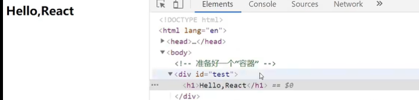

### React
* **React简介**
    * 什么是react?
        * React用于构建用户界面的JS库。是一个将数据渲染为HTML视图的开源JS库。
    * React特点
        * 采用组件化模式、声明式编码，提高开发效率及组建复用率
        * 在ReactNative中可以使用React语法进行移动端开发(如安卓或IOS应用)
        * 使用虚拟DOM(不是页面上的真是DOM,是React操作的,专门为React用的，没放在页面上的DOM,放在代码运行时电脑的内存里)和优秀的Diffing算法啊，尽量减少与真实DOM的交互
    * React高效的原因
        * 使用虚拟(virtual)DOM不总是直接操作界面真实DOM
        * DOMDiffing算法,最小化页面重绘
* **第一章：React入门**  
    * 1.引入三个包
        * 先引入react.development.js
        * 后引入react-dom.development.js
        * 再引入babel.min.js 
    * 2. 创建一个容器
        * ```<div id="test"></div>```
    * 3. 创建虚拟DOM,渲染到容器中
        * 
        ```
            <!-- 表示这里写的不是js,是jsx,且此处一定要写babel,啥都不写那默认就是js -->
            <script type="text/babel">
                // 1.创建虚拟DOM,此处不要写引号，因为不是字符串
                 const VDOM=<h1>Hello,React</h1>
                // 2.渲染虚拟DOM到页面
                ReactDOM.render(VDOM,document.getElementById("test"))
            </script>
        ```
        * 顺利的话会在页面中的div容器里添加h1,但是我没有
            * 
    * **两种方法创建虚拟DOM**
        * 1. 使用JSX创建
            * 
            ```
            const VDOM=(
                <h1 id="title">
                    <span>Hello,React</span>
                </h1>
            )
            ```
        * 2.使用JS创建
            * 
            ``` 
                const VDOM=React.createElement('h1',{id:'title'},React.createElement('span',{},'Hello,Raect'))
            ```
        * **使用JS创建虚拟DOM比使用JSX要复杂,还是比较推荐使用JSX来创建,且JSX使用babel翻译后就是JS的格式** 
        * 关于虚拟DOM:
            * 1.本质是Object类型的对象(一半对象)
            * 2.虚拟DOM比较“轻”,真实DOM比较“重,因为虚拟DOM是React内部在用,无需真实DOM上那么多的属性
            * 3.虚拟DOM最终会被React转化为真实DOM,呈现在页面上
            * ```
                const TDOM=document.getElementById('demo')
                console.log('虚拟DOM',VDOM);  //虚拟DOM Object
                console.log('真实DOM',TDOM);  //真实DOM <div id="demo"></div>
                debugger;
            ```

    * **JSX基础语法规则**
        * 1.定义虚拟DOM时,不能使用引号
        * 2.标签中混入JS表达式时要用{}
        * 3.样式的类名指定不要用class,要用className
        * 4.内联样式,要用style={{key:value}}形式写
        * 5.虚拟DOM必须只有一个根标签,要不然全是报错
        * 6.标签必须闭合,如input标签,要么写成```<input type="text"></input>```；要么让标签自闭合```<input type="text" />```
        * 7.标签首字母
            * (1)若小写字母开头,则将该标签转为html中同名元素,若html中无改标签对应的同名元素,则报错
            * (2)若大写字母开头,react就去渲染对应的组件,若组件没有定义，则报错

        * JSX小练习
            * 给react数组，react会帮助遍历数组，但如果给了对象，无法展示任何东西，如图：
                * 

* **第二章React面向组件编程**
    * 什么是组件？
        * 组件是用来实现局部功能效果的代码和资源的集合(html/css/js/image等待)
        * 作用:复用编码，简化项目编码，提高运行效率
    * 函数式组件
        * 用函数的形式创建一个组件,组件名头一个字母必须大写,因为小写的话会去html标签中找，没有找到就会给你报错；并且必须要有返回值
            * ```
                function MyComponent() {
                    // console.log(this);  //此处的this是undefined，因为babel编译后开启了严格模式
                    return <h2>他是用函数定义的组件(适用于[简单组件]的定义)</h2>
                }
              ```
        * 渲染组件到页面上，```ReactDOM.render(<MyComponent/>,document.getElementById('test'))```
        * 执行了ReactDOM.render(<MyComponent/>...)之后，发生了什么？
            * 1.React解析组件标签，找到了MyComponent组件
            * 2.发现组件是使用函数定义的，随后调用该函数，将返回的虚拟DOM转为真实DOM，随后呈现在页面中
    * 类式(Class)组件
        * 无需单独创建类，只需从React.Component继承，```class MyComponent extends React.Component{}```
        * 执行过程：
            * React解析组件标签，找到了MyComponent组件
            * 2.发现组件是使用类定义的，随后new出该类的实例，并通过该实例调用到原型上的render方法
            * 3.将render返回的虚拟DOM换位真实DOM，随后呈现在页面中
        * 另外，
            * render是放在哪里的？  MyComponent的原型对象上，供实例使用
            * render中的this是谁？  MyComponent的实例对象 <=> MyComponent组件的实例对象
                * 

    * **组件实例的三大属性**
        * 1.state 
            * state是组件对象最重要的属性，值是对象(可以包含多个key-value的组合)，记住！！！！绝对不可能是数组
            * 组价被称为“状态机”，通过更新组件的state来更新对应的页面显示(重新渲染组件)
            * **强烈注意**
                * 组件中的render方法中的this为组件实例对象
                * 组件自定义的方法中this为undefined，如何解决？
                    * 强制绑定this：通过函数对象的bind()
                    * 箭头函数，但是必须写成赋值语句+箭头函数的形式
                * 状态数据，不能直接修改或者更新，就用setState
            * 使用react开发工具查看，组件状态里有哪些数据都被罗列了
                * 
            * setState的使用
                * ```
                    <script type="text/babel">
                        //1.创建组件
                        class Weather extends React.Component{
                            constructor(props){
                                super(props)
                                // 初始化状态
                                this.state={isHot:false}
                                // 解决changeWeather中this指向问题
                                this.changeWeather=this.changeWeather.bind(this)
                            }
                            // render里的this就是组件的实例对象，render中做的最多的事就是，读取状态，根据状态的值做展示
                            render(){
                                // 读取状态
                                const {isHot,wind}=this.state
                                // 不用括号，括号是立即执行
                                // 将demo函数赋值给onClick作为回调，点击时，帮助调用demo
                                return <h1 onClick={this.changeWeather}>今天天真{isHot ? '热':'冷'}</h1>
                            }
                            changeWeather() {
                                // changeWeather放在哪里？  Weather的原型对象上，供实例使用
                                // 通过Weather实例调用changeWeather时，changeWeather中的态度就是Weather实例
                                // 由于changeWeather是作为onClick的回调，所以不是通过实例调用的，是直接调用的
                                // 类中的方法默认开启了局部开启的严格模式，所以changeWeather中的this为undefined
                                // console.log(this);  //{isHot: false}

                                // 获取原来的isHot值
                                const isHot=this.state.isHot
                                // 严重注意：状态必须通过setState进行更新，且更新是一种是合并，不是替换
                                this.setState({isHot:!isHot})

                                // 严重注意：状态(state)不可直接更改，下面这行就是直接更改！！！
                                // this.state.isHot=!isHot //这是错误的写法
                            }
                        }
                        //2.渲染组件到页面
                        ReactDOM.render(<Weather/>,document.getElementById('test'))

                        const w=new Weather()
                        w.changeWeather()
                    </script>
                ```
                * 构造器调用几次？  1次
                * render调用几次？  1+n次，1是初始化的那次，n是状态更新的次数
                * changeWeather调用几次？  点几次，调用几次
                * 严重注意：状态必须通过setState进行更新，且更新是一种是合并，不是替换
                    * ```this.setState({isHot:!isHot})```
            * state的简写方式，可以在类中直接写赋值语句，如下
                * ```
                    <script type="text/babel">
                        //1.创建组件
                        class Weather extends React.Component{
                            // 初始化状态
                            // 向Weather的实例对象身上添加一个属性，名为state，值为一个对象，也就是{isHot:false,wind:'刮大风'}
                            state={isHot:false,wind:'刮大风'}
                            
                            render(){
                                const {isHot,wind}=this.state
                                return <h1 onClick={this.changeWeather}>今天天真{isHot ? '热':'冷'},{wind}</h1>
                            }

                            // 自定义方法  写成赋值语句(constructor) + 箭头函数的形式
                            changeWeather = ()=> {
                                const isHot=this.state.isHot
                                this.setState({isHot:!isHot})

                            }
                        }
                        //2.渲染组件到页面
                        ReactDOM.render(<Weather/>,document.getElementById('test'))
                    </script>

                ```
                * 可以看出构造器没了，直接向Weather的实例对象身上添加了属性，名为state，值为一个对象；且自定义的方法，写成了赋值语句 + 箭头函数的形式，
                    * 因为箭头函数有一大特点，就是没有自己的this，但是如果要在箭头函数里使用了this关键字的话，会找其外层函数的this作为箭头函数的this，在上面的代码中，箭头函数内打印出来的this就是Weather的实例，如图：
                        * 
        * 2.props
            * 理解：
                * 1）每个组件对象都会有props(properties的简写)属性
                * 2）组件标签的所有属性都保存在props中
            * 作用：
                * 1）通过标签属性从组件外向组件内传递变化的数据/props主要用来传递数据，比如组件之间进行传值
                * 2）注意：组件的内部不要修改props数据
            * 基本使用：
                * ```
                    <script type="text/babel">
                        //创建组件
                        class Person extends React.Component{
                            render(){
                                // console.log(this);
                                const {name,age,gender}=this.props
                                return (
                                    <ul>
                                        <li>姓名：{name}</li> 
                                        <li>性别：{gender}</li>    
                                        <li>年龄：{age+1}</li>
                                    </ul>
                                )
                            }
                        }

                        // 渲染组件
                        ReactDOM.render(<Person name="tom" age={18} gender="female"/>,document.getElementById('test1'))
                        ReactDOM.render(<Person name="jerry" age={19} gender="male"/>,document.getElementById('test2'))
                        
                        const p={name:'老司',gender:'female',age:24}
                        ReactDOM.render(<Person {...p} />,document.getElementById('test3'))
                    </script>
                ```
            * 对props进行限制
                * ```
                    <script type="text/babel">
                        //创建组件
                        class Person extends React.Component{
                            render(){
                                // console.log(this);
                                const {name,gender,age}=this.props
                                // props是只读的
                                // this.props.name='jack' //此行代码会报错，因为props是只读的
                                return (
                                    <ul>
                                        <li>姓名：{name}</li> 
                                        <li>性别：{gender}</li>    
                                        <li>年龄：{age+1}</li>
                                    </ul>
                                )
                            }
                        }
                        // 对标签属性进行类型、必要性的限制
                        // Person.属性规则={name:'必传，字符串'}
                        Person.propTypes={
                            name:PropTypes.string.isRequired,  //限制name必传，且为字符串
                            gender:PropTypes.string,  //限制gender为字符串
                            age:PropTypes.number,  //限制age为数值
                            speak:PropTypes.func,  //限制speak方法为函数
                        }
                        // 指定默认的标签属性值
                        Person.defaultProps={
                            gender:'male',  //gender默认值为male
                            age:19  //age默认值为19
                        }

                        // 渲染组件
                        ReactDOM.render(<Person name="tom" gender="female" speak={speak}/>,document.getElementById('test1'))
                        ReactDOM.render(<Person name="jerry" gender="male" age={19}/>,document.getElementById('test2'))
                        
                        const p={name:'老司',age:24,gender:'female'}
                        // ReactDOM.render(<Person name={p.name} gender={p.gender} age={p.age} />,document.getElementById('test3'))
                        ReactDOM.render(<Person {...p} />,document.getElementById('test3'))
                        
                        function speak() {
                            console.log('我说话了');
                        }
                        
                    </script>
                ```
            * props简写方式
                * ```
                    <script type="text/babel">
                        //创建组件
                        class Person extends React.Component{
                            // 对标签属性进行类型、必要性的限制
                            // Person.属性规则={name:'必传，字符串'}
                            static propTypes={
                                name:PropTypes.string.isRequired,  //限制name必传，且为字符串
                                gender:PropTypes.string,  //限制gender为字符串
                                age:PropTypes.number,  //限制age为数值
                                speak:PropTypes.func,  //限制speak方法为函数
                            }

                            // 指定默认的标签属性值
                            static defaultProps={
                                gender:'male',  //gender默认值为male
                                age:19  //age默认值为19
                            }

                            render(){
                                // console.log(this);
                                const {name,gender,age}=this.props
                                // props是只读的
                                // this.props.name='jack' //此行代码会报错，因为props是只读的
                                return (
                                    <ul>
                                        <li>姓名：{name}</li> 
                                        <li>性别：{gender}</li>    
                                        <li>年龄：{age+1}</li>
                                    </ul>
                                )
                            }
                        }

                        // 渲染组件
                        ReactDOM.render(<Person name="tom" gender="female" age={18} speak={speak}/>,document.getElementById('test1'))
                        ReactDOM.render(<Person name="jerry" gender="male" age={19}/>,document.getElementById('test2'))
                        
                        const p={name:'老司',age:24,gender:'female'}
                        // ReactDOM.render(<Person name={p.name} gender={p.gender} age={p.age} />,document.getElementById('test3'))
                        ReactDOM.render(<Person {...p} />,document.getElementById('test3'))
                        
                        function speak() {
                            console.log('我说话了');
                        }
                    </script>
                ```
            * 操作：
                * 扩展属性：将对象的所有属性通过props传递
                    * ```<Person {...p} />```
                * 默认属性值
                    * ```
                        Person.propTypes={
                            name:PropTypes.string.isRequired,  //限制name必传，且为字符串
                            gender:PropTypes.string,  //限制gender为字符串
                            age:PropTypes.number,  //限制age为数值
                        }
                    ```
                * 组件类的构造器
                    * ```
                        constructor(props){
                            // 构造器是否接收props，是否传递给super，取决于是否希望在构造器中通过this访问props
                            // console.log(props);
                            super(props)
                            // 构造器中可以不传props参数，super方法中也可以不传props，虽然看起来没什么影响，但是在构造器中无法使用this(实例).props的方式取值
                                // 如果想要在构造器内使用this.props的方式取值，就需要向构造器和super中传递props参数
                            console.log('constructor',this.props);  //constructor Object
                        }
                    ```
        * 3.refs 
            * 可以理解为打标识。不需要写id，最终会收集所有以ref为标识的标签，到refs属性中，收集之后的ref，不是虚拟DOM，而是该虚拟DOM转成真实DOM之后的节点
            * 字符串形式的refs
                * 
            * 回调函数形式的refs
                * ```<input ref={(a)=>{this.input1=a}} type="text" placeholder="点击按钮提示数据"/>&nbsp;```的意思是把ref当前所处的节点(也就是input)，挂在实例自身上(this)，取名为input1
            * createRef创建ref容器
                * ```myRef=React.createRef()```
                * ```<input ref={this.myRef} />```
            * 发生事件的元素是要操作的元素时，可以省略ref
                * 
            * 非受控组件
                * 页面中所有的输入类的DOM，现用现取就是**非受控组件**，就像：
                    * 啥是现用现取？点击了登录按钮，就会调用handleSubmit回调函数，就会取```const {username,password}=this```这个节点，```alert(`你输入的用户名是:${username.value},密码是:${password.value}`)```这个操作是取节点的value值，这就属于现用现取
                    * ```
                        class Login extends React.Component{
                            handleSubmit=(event)=>{
                                event.preventDefault()  //阻止表单提交
                                const {username,password}=this
                                alert(`你输入的用户名是:${username.value},密码是:${password.value}`)
                            }

                            render(){
                                return(
                                    <form onSubmit={this.handleSubmit}>
                                        用户名：<input ref={c=>this.username=c} type="text" name="usrename"/>
                                        密码：<input ref={c=>this.password=c} type="password" name="password"/>
                                        <button>登录</button>
                                    </form>
                                )
                            }
                        }
                    ```
            * 受控组件
                * 页面中所有输入类的DOM，下面的就是input框，随着用户的输入，可以把值维护到状态中，也就是state中，需要的时候，直接从状态中取出使用，这就是**受控组件**，优点是，可以省略掉ref
                * 取出来的值是什么取决于是怎么放的，怎么取值取决于值放在哪儿了，```const {username,password}=this.state```中，this.state里拿到的username和password是真正的值，所以弹窗中不能写```username.value```或```password.value```，取出来的值会是undefined
                    * 
                * ```
                    class Login extends React.Component{
                        // 初始化状态
                        state={
                            username:'', //用户名
                            password:''  //密码
                        }

                        // 保存用户名到状态中
                        saveUsername=()=>{
                            this.setState({username:event.target.value})
                        }

                        // 保存密码到状态中s
                        savePassword=()=>{
                            this.setState({password:event.target.value})
                        }

                        // 表单提交的回调
                        handleSubmit=(event)=>{
                            event.preventDefault()  //阻止表单提交
                            const {username,password}=this.state
                            alert(`你输入的用户名是:${username},密码是:${password}`)
                        }

                        render(){
                            return(
                                <form onSubmit={this.handleSubmit}>
                                    用户名：<input onChange={this.saveUsername} type="text" name="usrename"/>
                                    密码：<input onChange={this.savePassword} type="password" name="password"/>
                                    <button>登录</button>
                                </form>
                            )
                        }
                    }
                ```
        * 高阶函数&函数柯里化
            * 下面这种情况的含义是saveFormData的返回值(这个返回值依然是个函数，这个函数才是真正的onChange的回调)交给了onChange作为回调，不是将saveFormData函数交给onChange作为回调
                * ```用户名：<input onChange={this.saveFormData('username')} type="text" name="usrename"/>```
                * ```用户名：<input onChange={this.saveFormData} type="text" name="usrename"/>```这样才是将saveFormData函数交给onChange做回调
            * 不用函数柯里化的实现
                * onchange需要一个函数作为回调，React就会，调用函数，传入event参数，通过event.target.value就可以取到值，在下面的箭头函数中调用了this.saveFormData，在这里没用柯里化，但是也实现了
                    * ```
                        class Login extends React.Component{
                            // 初始化状态
                            state={
                                username:'', //用户名
                                password:''  //密码
                            }

                            // 保存表单数据到状态中
                            saveFormData=(dataType,event)=>{
                                    this.setState({[dataType]:event.target.value})
                                }
                            }

                            // 表单提交的回调
                            handleSubmit=(event)=>{
                                event.preventDefault()  //阻止表单提交
                                const {username,password}=this.state
                                alert(`你输入的用户名是:${username},密码是:${password}`)
                            }

                            render(){
                                return(
                                    <form onSubmit={this.handleSubmit}>
                                        用户名：<input onChange={event=>this.saveFormData('username',event.target.value)} type="text" name="usrename"/>
                                        密码：<input onChange={event=>this.saveFormData('password',event.target.value)} type="password" name="password"/>
                                        <button>登录</button>
                                    </form>
                                )
                            }
                        }
                    ```
        * 组件的生命周期(旧)，React的声明周期就像在关键的点，调用特殊的函数componentDidMount和componentWillUnmount函数，在函数里面完成特殊的事情
            * 组件挂载流程，就像人的一生，
                * 出生了 ==> 组件挂载完毕后调用componentDidMount函数
                * 中间学会了很多事 ==> 记录一下
                * 病危了(还没死) ==> 调用componentWillUnmount函数，在里面清除定时器
            * ```
                // 创建组件
                // 生命周期回调函数 <=> 生命周期钩子函数 <=> 生命周期函数 <=> 生命周期钩子
                class Life extends React.Component{
                    state={opacity:1}

                    // 赋值语句+箭头函数，作为事件的回调函数使用
                    death=()=>{
                        // 卸载组件
                        ReactDOM.unmountComponentAtNode(document.getElementById('test'))
                    }
                    
                    // 它为啥不写成赋值语句+箭头函数的形式？因为它跟render是兄弟，这个函数是通过Life的实例对象调用的
                    // 组件挂载完毕之后调用
                    componentDidMount(){
                        this.timer=setInterval(()=>{
                            // 获取原状态
                            let {opacity}=this.state
                            // 减小0.1
                            opacity-=0.1
                            if(opacity<=0) opacity=1
                            // 设置新的透明度/更新状态
                            this.setState({opacity})
                        },200)
                    }

                    // 组件将要卸载
                    componentWillUnmount(){
                        // 清除定时器
                        clearInterval(this.timer)
                    }

                    // render调用的时机：初始化渲染、状态更新之后
                    render(){
                        console.log('render');
                        
                        return (
                            <div>
                                <h2 style={{opacity:this.state.opacity}}>React学不会怎么办?</h2>
                                <button onClick={this.death}>老师说别活了</button>
                                
                            </div>
                        )
                    }
                }
            ```
                * 理解：
                    * 1.组件从创建到苏王会经历一些特定的阶段
                    * 2.React组件中包含一系列钩子函数(生命周期回调函数)，会在特定的时刻调用
                    * 我们在定义组件时，回来特定的生命周期回调函数中做特定的工作
            * setState流程  --正常更新，是建立在真的修改了里面的数据，才会帮我更新，**前提是```shouldComponentUpdate()```这个阀门要开启**
                * shouldComponentUpdate()  --这个钩子函数控制组件更新的“阀门”，即使不写底层的React也会帮我补一个，而且返回值为true。但是如果我写了就以我写的为准，我手动写的这个必须要亲自写个返回值，且值为true，要不然后边写多少都白扯
                * componentWillUpdate()  --组件将要更新的钩子
                * componentDidUpdate()  --组件更新完毕的钩子，即使把它写在最前面也不是先调用它的，它肯定是在倒数第二部的时候被调用的
            * forceUpdate流程  --强制更新，是即使没有修改组件里的数据或状态，就是想更新一下，就可以走这条路。不像setState()，需要有shouldComponentUpdate()这个阀门，强制更新里面，因为没有写死，数据或状态修改没修改都可以更新
                * ```
                    force=()=>{
                        this.forceUpdate()
                    }
                ```
            * 父组件render流程
                * componentWillReceiveProps()，按照流程写完执行，首先会调用render()，**前提是render里写了输出**，**shouldComponentUpdate阀门必须是开启才能正常执行**，然后点击按钮页面会变化，并且后面的钩子函数会按顺序执行，如图(图放在代码下面)：
                    * ```
                        class B extends React.Component{
                            // 组件将要接受新的props的钩子
                            componentWillReceiveProps(props){
                                console.log('B--componentWillReceiveProps',props);

                            }
                            shouldComponentUpdate(){
                                console.log('B--shouldComponentUpdate');
                                return true
                            }
                            // 组件将要更新的钩子
                            componentWillUpdate(){
                                console.log('B---componentWillUpdate');
                            }
                            // 组件更新完毕的钩子
                            componentDidUpdate(){
                                console.log('B---componentDidUpdate');
                            }
                            render(){
                                console.log('B--render');
                                return (
                                    <div>我是B组件,接收到的游戏是:{this.props.gameName}</div>
                                )
                            }
                        }
                    ```
                    * 
                    * 
        * 组价的生命周期(新)，相较于旧的生命周期，即将废弃三个Will钩子(componentWillReceiveProps,componentWillMount,componentWillUpdate)，而添加了两个新的钩子(getDerivedStateFromProps,getSnapshotBeforeUpdate)，如图：
            * .PNG)
                * 新的生命周期(图)里的**React更新DOM和refs**是一个固定的小环节，在这个环节不会有什么输出
            * getDerivedStateFromProps()，直译为从props得到派生/衍生的状态，但是这种派生状态会导致代码冗余，并组件难以维护，所以，了解即可。
                * ```
                    static getDerivedStateFromProps(props){
                        console.log('Count--getDerivedStateFromProps',props);
                        return props
                    }
                ```
                * 加上上面这段代码我的状态值(state值)在任何情况下，都取决于props。无论初始化状态的值或是修改的值都会无效，这适用于极特殊的状态，就是状态值完全取决于props的时候。若state的值在任何时候都取决于props，那么可以使用(不是必须)getDerivedStateFromProps
            * getSnapshotBeforeUpdate(),直译为更新前得到快照
                * snapshot译为快照，按照新react生命周期图中的顺序，这个钩子在render()和componentDidUpdate()之间，但是和getDerivedStateFromProps()一样也需要有返回值，可以是null，也可以是快照值(snapshot value)。这个快照值可以是任何值，如，字符串、数组、对象、函数，都可以
                    * 
                * 
                * 稍微改进一下，向组件中定义一个props，props命名为count，其值为199。在getDerivedStateFromProps钩子函数中设置一个if语句，当state.count的值为偶数时，输出数字2，返回值为null(意思是在这个钩子函数里传递的state参数不从props中取值)；当state.count的值为奇数时，输出数字199，返回值为props(意思是state值从props中取值)。点击“点我+1”按钮后state值也会随之改变，第一次渲染时，state从构造器里的初始化状态值中取值，所以输出为2，返回值为null；第一次点击后，count值为1，输出199，return props；第二次点击开始，state就会从props中取值，且因为有componentDidUpdate钩子函数中传递之前的props值(preProps)、state值(preState)和快照值(snapshotValue)，所以之后的派生状态值(就是getDerivedStateFromProps里传递的state参数和输出的state值)，就会从props中取值，因此输出数字2，return null。咋走新来一个文件运行一下。
                    * ```
                        class Count extends React.component{
                            static getDerivedStateFromProps(props,state){
                                console.log('Count--getDerivedStateFromProps',props,state);
                                if (state.count %2 ===0){
                                    console.log(2);
                                    return null
                                }else{
                                    console.log(199);
                                    return props
                                }
                                // return null
                            }
                            getSnapshotBeforeUpdate(){
                                console.log('getSnapshotBeforeUpdate');
                                return 'atguigu'
                            }
                            // 组件更新完毕的钩子
                            componentDidUpdate(preProps,preState,snapshotValue){
                                console.log('Count---componentDidUpdate',preProps,preState,snapshotValue);
                            }
                        }
                        // 渲染组件
                        ReactDOM.render(<Count count={199}/>,document.getElementById('test'))
                        
                    ```
                * 例子：每隔一秒就会在容器中有新的新闻加载出来，但是我想要看某一个新闻，滚动到那个新闻后想要让滚动条停在想看的新闻的位置上。但是新的新闻必须继续加载出来，并且不会将我定位好的新闻的位置顶替上去
                    * ```
                        class NewsList extends React.Component{
                            // 初始化状态
                            state={newsArr:[]}

                            componentDidMount(){
                                setInterval(()=>{
                                    // 获取原状态
                                    const {newsArr}=this.state
                                    // 模拟一条新闻
                                    const news='新闻'+(newsArr.length+1)
                                    // 更新状态  新生成的状态,之前的状态
                                    this.setState({newsArr:[news,...newsArr]})
                                },1000)
                            }

                            render(){
                                return (
                                    <div className="list" ref="list">
                                        {
                                            this.state.newsArr.map((n,index)=>{
                                                return <div key={index} className="news">{n}</div>
                                            })
                                        }
                                        
                                    </div>
                                )
                            }

                            getSnapshotBeforeUpdate(){
                                return this.refs.list.scrollHeight
                            }

                            componentDidUpdate(preProps,preState,height){
                                this.refs.list.scrollTop += this.refs.list.scrollHeight-height
                            }
                        }
                    ```
            * 重要的钩子
                * 1. render:初始化渲染或更新渲染调用
                * 2. componentDidMount:开启监听，发送ajax请求
                * 3. componentWillUnmount:做一些收尾工作，如：清除定时器
            * 即将废弃的钩子。最新版需要加上UNSAFE_前缀才可以使用，以后可能会彻底废弃，不建议使用
                * 1. componentWillMount
                * 2. componentWillReceivedProps
                * 3. componentWillUpdate
        * DOM的Diffing算法
            * 这个算法是逐层对比的，最小的力度是标签/节点，标签里套标签之后，会和之前的标签进行对比，没有重新生成，重新放置的话就是

* **第三章：react应用(给予react脚手架)**
    * 3.1 使用create-react-app创建react应用
        * 3.1.1 react脚手架
            * 1. 脚手架：让程序员快速、方便地编写一个基于某种技术(Angular,React,Vue)的应用/模板项目。
                * 1) 包含了所有需要的配置(语法检查、jsx编译、devServer...)，都是webpack相关的东西。
                * 2) 下载好了所有相关的依赖
                * 3) 可以直接运行一个简单效果
            * 2. react提供了一个用于创建react项目的脚手架库：create-react-app
            * 3. 项目的整体技术架构为：react + webpack + es6 + eslint
            * 4. 使用脚手架开发的项目的特点：模块化、组件化、工程化
        * 3.1.2 创建项目并启动
            * 第一步，全局安装：npm install -g create-react-app
            * 第二步，切换到想创建项目的目录，使用命令：create-react-app react_staging
            * 第三步，进入项目文件夹：cd hello-react
            * 第四步，启动项目：npm start
        * 3.1.3
            * public---静态资源文件夹
                * favicon.icon--网站页签图标
                * **index.html--主页面**
                * logo192.ppng--logo图
                * logo512.png--logo图
                * manifest.json--应用加壳的配置文件
                * robots.txt--爬虫协议文件
            * src---源码文件夹
                * App.css--App组件的样式
                * **App.js--App组件**
                * app.test.js--用于给App做测试
                * index.css--样式
                * **index.js--入口文件**
                    * index.js中，渲染组件的操作中，<APP/>的外侧为什么要包裹<React.StrictMode></React.StrictMode>？
                        * 能检查APP以及APP里所有子组件写的东西是否合理
                * logo.svg--logo图
                * reportWebVitals.js文件是干嘛的？
                    * 是用于记录页面上的性能的，里面用上了web-vitals这个库
                * setupTest.js
                    * 用于应用的整体测试，也就是用于组件测试，或者是某一个模块/单元的测试，需要有jest-dom库做支持
        * 3.1.4脚手架介绍
            * 样式的模块化
                * 当两个先后引入的组件的样式名相同时，后引入的组件的样式会把先引入的组件的样式覆盖掉，最终只会以后引入的组件的样式为主，详细看Welcome组件和Hello组件
                * 这样影响非常不好，所以为了避免样式的冲突，可以：
                    * 1. 样式文件写 .less文件，因为less文件可以嵌套，就像这样
                        * ```
                            .welcome{
                                .demo{
                                    background-color: lightblue;
                                }
                            }
                          ```
                    * 2. 样式文件写成```xxx.module.css```，在组件上用变量接一下```import 变量 from './xxx.module.css'```，在此步骤会自动帮我整理成对象。最后在标签中写成 变量.类名
        * 3.1.5 功能界面的组件化编码流程(通用)
            * 1. 拆分组件：拆分界面，抽取组件
            * 2. 实现静态组件：使用组件实现静态页面效果
            * 3. 实现动态组件
                * 3.1 动态显示初始化数据
                    * 3.1.1 数据类型
                    * 3.1.2 数据名称
                    * 3.1.3 保存在哪个组件？
                * 3.2 交互(从绑定事件监听开始)

    * 3.2组件的组合使用--TodoList
        * 1. 拆分组件，抽取组件
            * Header.jsx
            * Item.jsx
            * List.jsx
            * Footer.jsx
        * 2. 实现静态组件：使用组件实现静态页面效果
            * 拆文本文件(html)和样式文件(css)到各个组件中和要被引入到各个组件的样式文件
        * 3. 实现动态组件
            * **状态中的数据驱动着页面的展示，每一个组件都有自己的状态**
                * 如图所示，List中的状态帮我保存一堆要做的事(就是todos)。Header组件把输入的数据交给List组件，List会把这些数据放在自己的状态(state)里，随后状态会驱动页面的展示，打包后会在页面中显示
                * 
            * **两个组件之间传递数据就叫组件间通信，如果子组件想给父组件传递数据，父组件就需要先前通过props给子组件传递一个函数，而子组件在适当的时候(也就是子组件想给父组件传递数据的时候)，也就是想要给父组件传递数据时，调用一下这个函数即可**
                * 父组件(外壳组件)--App.jsx
                * 子组件1--Header.jsx
                * 子组件2--List.jsx
                * 整体的交互模型是这样的，App组件里存储着一堆要做的事，这些事传给了List，App又给Header传递了一个函数，这个函数后续能接收todoObj。Header组件会在合适的时候调用App这个父组件传递的函数，把todoObj交给App，App拿到todoObj之后会放在自己的状态里，就引起了App状态的更改，App状态一更改，App里的render就会重新被调用，这样就会引发App的子组件List的重新渲染，然后List里的内容就会有所变化。
            * **状态在哪里，操作状态的方法就在哪里**
                * 祖先组件--App.jsx
                * 父组件--List.jsx
                * 组件--Item.jsx
                * 勾选、取消勾选某一个todo的操作是通过改变单个的input节点中的done的状态来实现的，因为Item无法向List或App传递数据，所以父组件(List)需要给Item中传递一个函数，就是handleCheck。App又需要给List传递函数updateTodo，所以合适的时候回按顺序调用，当勾选或取消勾选某个todo的时候，首先执行handleCheck函数，随后执行updateTodo函数，进入匹配处理数据的判断中，结果相同，返回新的todoObj和更改后的done值，如果不同，就返回原来的值
                    * 

* **第四章：reactajax**
    * 4.1 理解
        * 4.1.1 前置说明
            * 1. React本身只关注于界面，并不包含发送ajax请求的代码(如：React.ajax(url) 这种是不可能存在的)
            * 2. 前端应用需要通过ajax请求与后台进行交互(json数据)
            * 3. react应用中需要继承第三方ajax库(或自己封装，但是自己封装用得少，一般用第三方的)
        * 4.1.2 常用的ajax请求库
            * 1. jQuery：比较重，如果需要另外引入，不建议使用
            * 2. axios：轻量级，建议使用
                * 1) 封装XMLHTTPRequest对象的ajax
                * 2) promise风格
                * 3) 可以用在浏览器端和node服务器端
    * 4.2 axios
        * 4.2.1 文档

###  总结
* speak中的this是谁，得看是怎么调用的
* class,创建类组件时，react会在内部帮你做一个new的操作去实例化当前的类组件
* 借助构造器存值
* 函数体里面可以写任意的代码，但是类里不能写函数形式的方法
    * ```function xxx(){}```就不行
* 构造器里的this是组件的实例对象，render中的this是组件的实例对象，changeWeather因为不是通过组件(Weather)实例对象调用的，所以changeWeather中的this是undefined
* 类中我定义的所有的方法，类会在局部中自动给开启严格模式，这跟babel没关系
    * 如在函数体内开启严格模式，在外部直接调用这个函数时，会返回undefined
        * ```
            function demo() {
                'use strict'
                console.log(this);  //undefined
            }
            demo()

            function demo2() {
                // 'use strict'
                console.log(this);  //Window
            }
            demo2()
          ```
* 原理就是借助了构造器函数、render函数、类本身中的this指向实例，可以有多种解决方法
* 在条件允许的情况下，尽量避免使用字符串形式的ref，就是能避免就避免，但是特别着急的情况下还是可以放肆一下的
* 生命周期勾子函数什么时候调用和写代码的顺序是无关的，最先调用的是render()，只要写了React就会适时调用。啥时候是适时呢？比如componentDidMount是在调用render之后调用的
* 只有真实DOM被渲染到页面上，用户才可以进行输入内容等操作，虚拟DOM身上属性很少，比如没有value值，而真实DOM有，只有在真实DOM中才可以留下和保存用户输入的内容
* react脚手架文件介绍里，文件执行顺序
    * 先来到src/index.js中引入资源文件，渲染App组件，随后到public/index.html中找root节点，保存到root容器中，渲染组件的代码执行完后，App组件就会在页面中展示。最后各种logo图和图标、reportWebVitals.js文件以及setupTest.js文件等等其他都是周边的，需要的话添加，不需要就没必要
* 都是.js文件，如何区分哪个是组件，哪个是普通的、具有js业务功能的文件？
    * 1. 组件一般是首字母大写命名的js
    * 2. .jsx文件也是组件文件，在react脚手架里面，引入文件或资源时，不需要写后缀的有俩---.js&.jsx，
* 什么是组件？
    * 实现页面局部功能代码和资源的集合就是组件
* defaultChecked 只在第一次指定的时候有作用，第二次开始就没作用了
